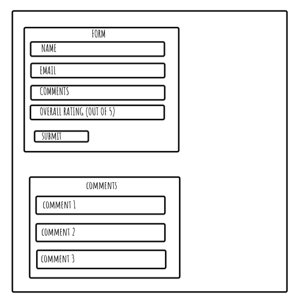

WIREFRAME:

TRELLO:
https://trello.com/b/n9iCjRia/techedwk4-assignment-guestbook

REQUIREMENTS ACHIEVED:

- Created Trello board (enjoyed this, really useful initially for keeping me on track, brought structure to project.)
- Used okso to create wireframe.
- Created a very basic blue background webpage, with 3 form fields (name, comment, drop down menu for rating) and a submit button. Included some validation to ensure the fields were required.
- The page was working and I could enter text. The closest I could get to this 'working' was that the content I entered in the form fields were added to the URL.

REQUIREMENTS UNABLE TO ACHIEVE:

- Once the form contents were added to the URL but not yet in a table below on the webpage, it all went wrong...
- I spent a long time trying to get it to work, but inadvertently made it worse over the weekend! I couldn't even get the webpage to load any more! I relied heavily on Google and ChatGPT but still can't fix it.
- As such, I've been unable to:

  1. Ensure HTML form is submitting data into the database as expected
  2. Use media queries/dynaminc CSS styling
  3. Confirm if I have a working GET API and POST API route
  4. Seed database with realistic-looking dummy data

WHAT WAS DIFFICULT?

- Knowing when to ask for help. I've learnt I feel more comfortable asking for help when I have multiple issues to justify taking someone's time!
- Fixing the problem of getting my webpage to actually load! This was such a big obstacle I couldn't then work on any of the other requirements.

WHAT DID I USE FOR HELP:

- Google! Tended to end up on stackoverflow where others had asked same question before.
- TechEd resources on Moodle
- ChatGPT to debug my code. I ended up using this HEAVILY on Saturday and Sunday, but it didn't actually help much in the end because I still couldn't get it to work. Felt like I was going round in circles.

REQUESTS FOR HELP:

- Could someone please advise how I can see my webpage in a browser again?

THOUGHTS:

- Had problems initially with Git, so moved this to block on Trello until I felt I had enough issues to justify seeking help from Manny/Joe. However, this meant several commits weren't made so if I were to come unstuck again, I would seek help sooner.
- I was initially looking forward to this assignment! I thought I just needed to follow this week's demos and include extra resources such as Trello, but I came unstuck and ended up deeeeeeeeeeeeeeeeep in a rabbit hole of debugging and fixing that I couldn't get out of! I realise now, late, that I could probably retrieve earlier code from GitHub but my last commit was so long ago, I've made too many changes to comfortably rely on that.
- My understanding and knowledge has improved and I'm getting more confident with the terminal but I do feel disappointed this week!
